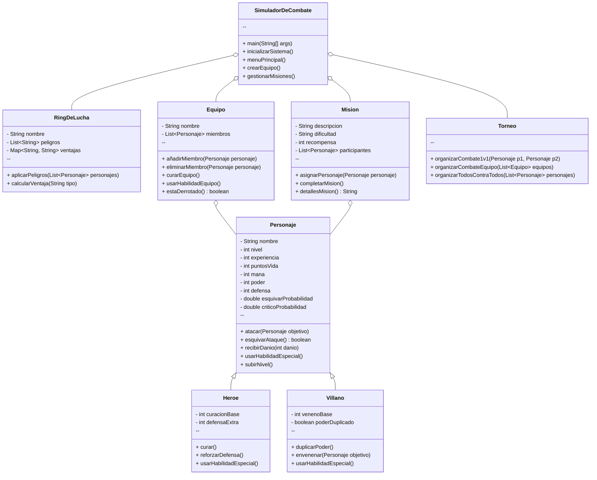

# Proyecto Evaluable: **Sistema de Simulación de Combates Épicos**

## Objetivo General
Desarrollar un sistema de simulación de combates en Java que utilice **herencia**, **polimorfismo** y **colecciones**, mientras se exploran los principios básicos de la programación orientada a objetos. Este proyecto permitirá a los estudiantes implementar y reforzar estos conceptos mediante el diseño de clases, jerarquías y la manipulación de datos usando estructuras dinámicas.

---

## Desglose del Proyecto

### **Parte 1: Contexto y Motivación**
En un mundo fantástico donde héroes y villanos se enfrentan constantemente, las batallas no solo se ganan con fuerza, sino también con estrategia y habilidades únicas. Los estudiantes diseñarán un sistema que permita crear personajes, organizar combates, y gestionar misiones y torneos.

El sistema debe incluir:
1. **Creación de héroes y villanos** con atributos personalizados.
2. Un **sistema de combate por turnos**.
3. Escenarios dinámicos (rings) que modifiquen las reglas de combate.
4. Un módulo para **torneos y misiones**.

---

## Requisitos Detallados
A continuación, se presentan los pasos concretos que los estudiantes deberán implementar:

---

### **1. Clase Abstracta `Personaje`**
La clase base para todos los personajes del juego.

#### Atributos:
- **`nombre`**: Nombre del personaje.
- **`nivel`**: Nivel del personaje, comienza en 1 y aumenta al ganar experiencia.
- **`experiencia`**: Puntos acumulados para subir de nivel.
- **`puntosVida`**: Vida actual del personaje.
- **`mana`**: Energía para usar habilidades especiales.
- **`poder`**: Daño base de los ataques.
- **`defensa`**: Reducción del daño recibido.
- **`esquivarProbabilidad`**: Probabilidad de esquivar ataques (0.0 a 1.0).
- **`criticoProbabilidad`**: Probabilidad de realizar un ataque crítico (0.0 a 1.0).

#### Métodos:
- **`atacar(Personaje objetivo)`**  
   Realiza un ataque básico al objetivo, calculando si es crítico y aplicando la defensa.
   
- **`esquivarAtaque()`**  
   Devuelve `true` si el ataque es esquivado.

- **`recibirDanio(int danio)`**  
   Reduce los puntos de vida del personaje tras calcular la defensa.

- **`usarHabilidadEspecial()`**  
   Método abstracto para habilidades únicas.

- **`subirNivel()`**  
   Incrementa los atributos del personaje (vida, poder, etc.).

---

### **2. Clase `Heroe`**
Heredada de `Personaje`, los héroes son personajes con habilidades de apoyo.

#### Atributos Específicos:
- **`curacionBase`**: Puntos de vida que el héroe puede restaurar.
- **`defensaExtra`**: Incremento temporal de defensa.

#### Métodos:
- **`usarHabilidadEspecial()`**  
   Implementación concreta para héroes:
   - **`curar()`**: Restaura puntos de vida.
   - **`reforzarDefensa()`**: Incrementa temporalmente la defensa.

---

### **3. Clase `Villano`**
Heredada de `Personaje`, los villanos son personajes con habilidades agresivas.

#### Atributos Específicos:
- **`venenoBase`**: Daño continuo infligido al usar veneno.
- **`poderDuplicado`**: Indica si el villano ha duplicado su poder.

#### Métodos:
- **`usarHabilidadEspecial()`**  
   Implementación concreta para villanos:
   - **`duplicarPoder()`**: Duplica temporalmente el poder del villano.
   - **`envenenar(Personaje objetivo)`**: Inflige daño continuo al objetivo.

---

### **4. Clase `RingDeLucha`**
Representa el escenario donde se realizan los combates.

#### Atributos:
- **`nombre`**: Nombre del ring.
- **`peligros`**: Lista de trampas o efectos negativos.
- **`ventajas`**: Ventajas específicas para héroes o villanos.

#### Métodos:
- **`aplicarPeligros(List<Personaje> personajes)`**
   Aplica trampas o efectos negativos a los personajes.

- **`calcularVentaja(String tipo)`**
   Ajusta atributos según si el personaje es héroe o villano.

---

### **5. Clase `Equipo`**
Representa un grupo de personajes (héroes y/o villanos) que pueden participar en combates de equipo.

#### Atributos:
- **`nombre`**: Nombre del equipo.
- **`miembros`**: Lista de personajes que forman parte del equipo.

#### Métodos:
- **`añadirMiembro(Personaje personaje)`**
   Añade un personaje al equipo.

- **`eliminarMiembro(Personaje personaje)`**
   Elimina un personaje del equipo.

- **`curarEquipo()`**
   Restaura puntos de vida a todos los miembros del equipo.

- **`usarHabilidadEquipo()`**
   Activa las habilidades especiales de todos los miembros del equipo.

- **`estaDerrotado()`**
   Devuelve `true` si todos los miembros del equipo están derrotados (puntos de vida ≤ 0).

---

### **6. Clase `Mision`**
Representa una misión que los personajes pueden completar para ganar experiencia y recompensas.

#### Atributos:
- **`descripcion`**: Descripción de la misión.
- **`dificultad`**: Nivel de dificultad de la misión.
- **`recompensa`**: Experiencia obtenida al completar la misión.
- **`participantes`**: Lista de personajes asignados a la misión.

#### Métodos:
- **`asignarPersonaje(Personaje personaje)`**
   Asigna un personaje a la misión.

- **`completarMision()`**
   Determina si los participantes pueden completar la misión (en función de atributos como nivel o poder). Si la misión se completa, otorga la recompensa.

- **`detallesMision()`**
   Devuelve una descripción detallada de la misión y los personajes asignados.

---

### **7. Clase `Torneo`**
Permite organizar batallas en diferentes modalidades.

#### Métodos:
- **`organizarCombate1v1(Personaje p1, Personaje p2)`**  
   Realiza un combate entre dos personajes.
   
- **`organizarCombateEquipo(List<Equipo> equipos)`**  
   Realiza un combate entre equipos.
   
- **`organizarTodosContraTodos(List<Personaje> personajes)`**  
   Organiza una batalla en la que todos los personajes luchan.

---

### **8. Clase Principal `SimuladorDeCombate`**
La clase principal del programa, donde se inicializa todo el sistema.

#### Métodos:
- **`main(String[] args)`**  
   Punto de entrada que inicia el sistema.

- **`inicializarSistema()`**  
   Crea héroes, villanos, equipos, misiones y rings para pruebas.

- **`menuPrincipal()`**  
   Muestra un menú para que el usuario elija opciones como crear personajes, iniciar combates, organizar torneos o realizar misiones.

- **`crearEquipo()`**  
   Permite a los usuarios formar un equipo seleccionando héroes y villanos disponibles.
   
- **`gestionarMisiones()`**  
   Permite asignar personajes a misiones y verificar si se completan.

---

## Diagrama de Clases

A continuación se presenta el diagrama de clases:

---
### **9. Propuestas para la 3EV**
Para el proyecto de la tercera evaluacion:
1. **Guardado y carga de datos:** Permitir guardar el progreso de los personajes y cargarlo en una nueva ejecución.
2. **Interfaz gráfica básica:** Crear una interfaz sencilla con `Swing` o una consola interactiva mejorada.
3. **Automatización:** Permitir que los combates sean automáticos si no hay un segundo jugador.

---
